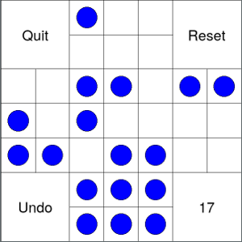

Week 1: Welcome!, data types, variables
---

**Welcome to CS21!** My name is Jeff Knerr (pronounced "nerr"). I am teaching
the MWF 10:30-11:20am section. This course is our _first course_ in Computer
Science (CS), so no prior knowledge of CS is required. **If you have taken AP
Computer Science in high school, or have a fair amount of programming experience 
(understand arrays, strings, searching, sorting, recursion, and classes), please
come see me the first week to make sure you are in the correct class**. This
class is intended for majors and non-majors, but if you have significant 
programming experience, we may want to move you up to one of the next courses
in CS (CS31 or CS35).

For our section we have two in-class _ninjas_: Emma, Sydney, and Alex.
If you get stuck in class or don't understand something I am explaining,
feel free to ask me or the ninjas.

My official office hours are on Fridays (12:30-2pm), but feel
free to make an appointment for help or just drop by. I am happy to
answer questions about class or lab work, or just review something
for quizzes.

What We Will Do In This Class
---

The goal for this course is, obviously, to give you an introduction to
Computer Science.  We do that by teaching you the *python programming
language*, as well as some basic CS concepts. Each week we will learn
something new, and then write computer programs (lab assignments) to
help reinforce what we just learned. In addition to learning to program,
and learning about CS, you will practice and learn *problem-solving*.
Designing and writing a program, as well as getting it to run correctly,
involves a lot of problem-solving.  Hopefully this is a skill that will
help you in life, whether you go on in CS or not.

The HiQ game we looked at today is a good example of what we will do in this 
class. By the end of the course, you should be able to write a simple graphical
puzzle/game, where the user clicks on boxes or pegs to move things
around.

Developing and analyzing algorithms is also what we will do in the course.
In your weekly lab assignments you will develop an algorithm and
implement it in the python programming language. This includes testing your program,
to make sure it works, and analyzing your algorithm, to make sure it is efficient.

