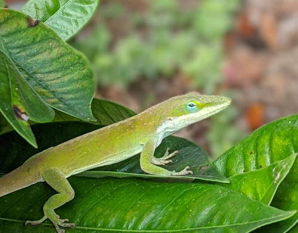

This is a post about lizards. I'm going to try to put a picture
in the post. And some other things to see if a search works.

The lizard is cure. I'm going to call them "Lily". Let's
see if the search box can find lily.

  Four Score and seven years ago our fathers brought forth on
this continent a new nation, conceived in Liberty, and dedicated
to the proposition that all men are created equal.

  Now we are engaged in a great civil war, testing whether that
nation, or any nation so conceived and so dedicated, can long endure.
We are met on a great battle-field of that war. We are met to dedicate
a portion of it as the final-resting place of those who here gave
their lives that that nation might live. It is altogether fitting
and proper that we should do this.

  But in a larger sense we cannot dedicate, we cannot consecrate, we
cannot hallow this ground. The brave men, living and dead, who
struggled here, have consecrated it far above our power to add or
detract. The world will little note nor long remember what we say
here, but it can never forget what they did here. It is for us, the
living, rather to be dedicated here to the unfinished work that they
have thus far so nobly carried on. It is rather for us to be here
dedicated to the great task remaining before us, --that from these
honored dead we take increased devotion to the cause for which they
here gave the last full measure of devotion, --that we here highly
resolve that the dead shall not have died in vain, that the nation
shall, under God, have a new birth of freedom, and that the
government of the people, by the people, and for the people, shall
not perish from the earth.

